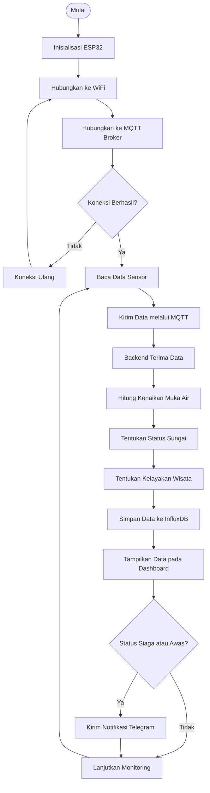
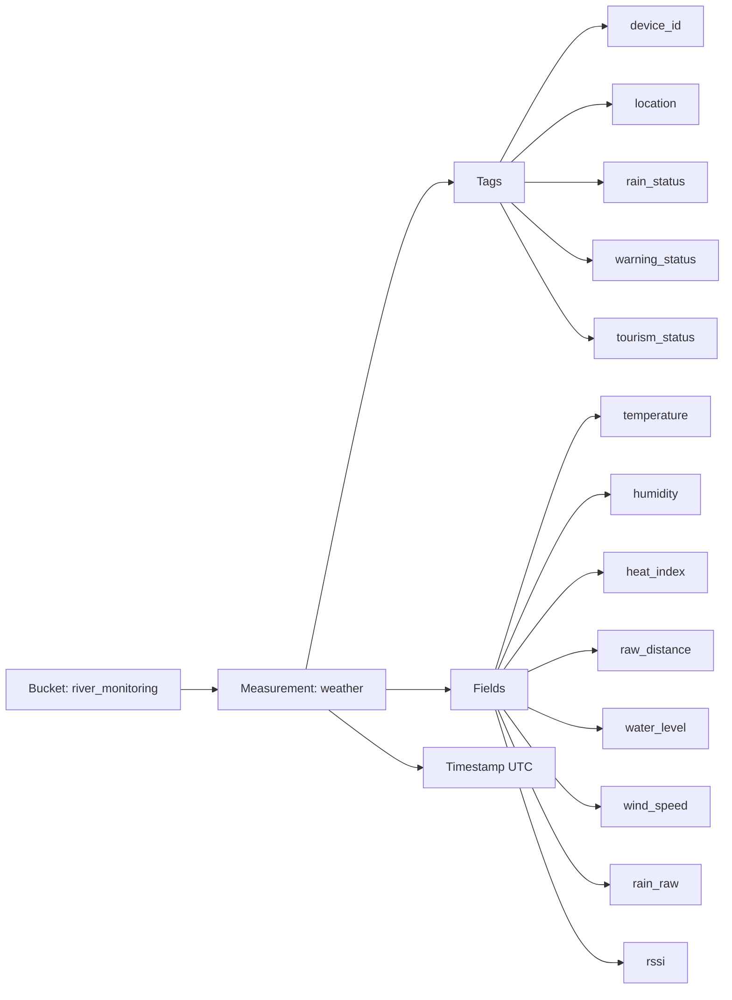
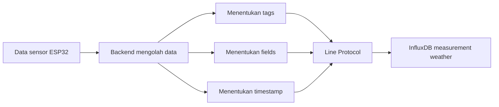

# BAB III
# PERANCANGAN SISTEM

## 3.1 Gambaran Umum Perancangan

Perancangan sistem dilakukan berdasarkan hasil analisis permasalahan pemantauan kondisi sungai di kawasan Pemandian Lubuk Lukum, Lubuk Minturun. Kawasan wisata yang berada di sekitar aliran Sungai Batang Air Dingin memiliki risiko terhadap perubahan tinggi muka air dan kondisi cuaca yang dapat memengaruhi keselamatan pengunjung.

Sistem yang dirancang bertujuan membantu pengelola memperoleh informasi kondisi sungai secara berkala dan tepat waktu. Sistem mencakup perangkat keras untuk membaca kondisi lingkungan, perangkat lunak untuk mengolah data, basis data untuk menyimpan hasil pemantauan, dashboard untuk menampilkan informasi, serta sistem peringatan apabila kondisi sungai berada pada tingkat yang membahayakan.

Secara umum, sistem membaca data dari sensor yang terpasang pada ESP32. Data tersebut dikirimkan ke server melalui jaringan WiFi menggunakan protokol MQTT. Data yang diterima server kemudian divalidasi dan diproses untuk menentukan kenaikan muka air, status sungai, serta kelayakan wisata berdasarkan kondisi lingkungan.

Hasil pengolahan disimpan ke dalam basis data InfluxDB dan ditampilkan melalui dashboard monitoring berbasis web. Dashboard menampilkan kondisi terbaru, histori pengukuran, grafik parameter sensor, status perangkat, serta rekomendasi kelayakan wisata. Apabila status sungai berada pada kondisi Siaga atau Awas, sistem mengirimkan notifikasi kepada pengelola melalui Telegram.

Status sungai ditentukan berdasarkan kenaikan muka air relatif terhadap kondisi normal. Sementara itu, kondisi hujan, heat index, dan kecepatan angin digunakan sebagai parameter pendukung dalam menentukan kelayakan wisata.

## 3.2 Perancangan Sistem

### 3.2.1 Rancangan Perangkat Keras (Hardware)

Perangkat keras digunakan untuk memperoleh data kondisi sungai dan lingkungan sekitar. Komponen utama yang digunakan terdiri atas ESP32, sensor JSN-SR04T, sensor AHT10, sensor hujan, anemometer, tombol reset, LED indikator, dan catu daya.

ESP32 berfungsi sebagai pusat kendali yang menerima data dari seluruh sensor, melakukan pengolahan awal, serta mengirimkan data ke server. Sensor JSN-SR04T digunakan untuk mengukur jarak antara sensor dan permukaan air. Sensor AHT10 digunakan untuk mengukur suhu dan kelembapan udara. Sensor hujan digunakan untuk membaca kondisi hujan berdasarkan nilai analog. Anemometer digunakan untuk mengukur kecepatan angin berdasarkan jumlah pulsa yang dihasilkan.

| No. | Komponen | Fungsi |
|---|---|---|
| 1 | ESP32 | Mengendalikan sensor dan mengirimkan data |
| 2 | JSN-SR04T | Mengukur jarak sensor terhadap permukaan air |
| 3 | AHT10 | Mengukur suhu dan kelembapan udara |
| 4 | Sensor hujan | Membaca kondisi hujan berdasarkan nilai analog |
| 5 | Anemometer | Mengukur kecepatan angin berdasarkan pulsa |
| 6 | Tombol reset | Mengatur ulang konfigurasi jaringan |
| 7 | LED indikator | Menunjukkan kondisi atau proses kerja perangkat |
| 8 | Catu daya | Menyediakan sumber tegangan bagi perangkat |

Data sensor dibaca secara berkala oleh ESP32. Data cuaca dikirimkan sekitar setiap 10 detik, sedangkan data heartbeat digunakan untuk menunjukkan kondisi perangkat dan dikirimkan sekitar setiap 60 detik. Data heartbeat digunakan oleh server untuk mengetahui apakah perangkat masih terhubung dan aktif.

### 3.2.2 Rancangan Perangkat Lunak (Software)

Perangkat lunak dirancang untuk mengatur proses pembacaan sensor, pengolahan data awal, pengiriman data, validasi data, klasifikasi kondisi sungai, penyimpanan data, visualisasi, serta pengiriman notifikasi.

Pada sisi ESP32, perangkat lunak digunakan untuk membaca sensor, menghitung nilai heat index, menghitung kecepatan angin, serta mengirimkan data melalui protokol MQTT. Pada sisi server, perangkat lunak digunakan untuk menerima data, melakukan validasi dan normalisasi, menghitung kenaikan muka air relatif, menentukan status sungai, menentukan kelayakan wisata, menyimpan data, dan menyediakan data kepada dashboard.

Perangkat lunak yang digunakan adalah sebagai berikut:

| No. | Perangkat Lunak | Fungsi |
|---|---|---|
| 1 | Arduino Framework | Menjalankan program pada ESP32 |
| 2 | PlatformIO | Mengelola pengembangan program ESP32 |
| 3 | Mosquitto | Menangani komunikasi MQTT |
| 4 | FastAPI | Menyediakan layanan backend dan REST API |
| 5 | InfluxDB | Menyimpan data pemantauan berbasis waktu |
| 6 | React | Membangun dashboard monitoring |
| 7 | Komunikasi Real-time (WebSocket via FastAPI) | Mengirimkan data terbaru secara real-time |
| 8 | Telegram Bot | Mengirimkan notifikasi peringatan |
| 9 | Docker | Menjalankan layanan sistem secara terisolasi |

### 3.2.3 Rancangan Flowchart

Flowchart pada Gambar 3.x menggambarkan alur kerja sistem monitoring kawasan wisata sungai secara keseluruhan. Proses dimulai dari inisialisasi ESP32, kemudian dilanjutkan dengan menghubungkan perangkat ke jaringan WiFi dan broker MQTT. Apabila koneksi berhasil, sensor akan membaca data lingkungan seperti jarak permukaan air, suhu, kelembapan, curah hujan, dan kecepatan angin. Data yang telah dibaca kemudian dikirimkan ke broker MQTT dan diterima oleh backend untuk diolah lebih lanjut.

Pada tahap pengolahan, backend menghitung kenaikan muka air relatif berdasarkan jarak normal dan jarak pengukuran saat ini. Hasil perhitungan digunakan untuk menentukan status sungai, yang terdiri atas Normal, Waspada, Siaga, dan Awas. Selanjutnya, backend menentukan kelayakan wisata yang dikategorikan menjadi Suitable, Caution, atau Not Recommended. Data hasil pengolahan disimpan ke dalam basis data InfluxDB dan ditampilkan pada dashboard monitoring.

Setelah data ditampilkan, sistem melakukan pemeriksaan terhadap status sungai. Jika status sungai berada pada tingkat Siaga atau Awas, sistem mengirimkan notifikasi kepada pengelola melalui Telegram. Sementara itu, untuk status Normal dan Waspada, sistem hanya menampilkan informasi pada dashboard tanpa mengirim notifikasi. Setelah proses tersebut selesai, sistem kembali melakukan pembacaan sensor untuk menjalankan monitoring secara berkelanjutan.



### 3.2.4 Rancangan Topologi Sistem

Topologi sistem menggambarkan hubungan antarbagian sistem, yaitu perangkat sensor, ESP32, jaringan komunikasi, broker MQTT, backend, basis data, dashboard, dan layanan notifikasi.

```text
Sensor
   ↓
ESP32 River Station
   ↓ WiFi
Mosquitto MQTT Broker
   ↓
Backend FastAPI
   ├── InfluxDB
   ├── React Dashboard
   └── Telegram Bot
```

ESP32 membaca data sensor dan mengirimkan data melalui jaringan WiFi menuju Mosquitto MQTT Broker. Broker MQTT meneruskan data tersebut kepada backend FastAPI.

Backend melakukan validasi, pengolahan, dan klasifikasi data. Data hasil pengolahan disimpan ke InfluxDB. Backend juga menyediakan data kepada dashboard melalui REST API dan mengirimkan pembaruan data secara real-time melalui WebSocket.

Apabila terjadi kondisi sungai Siaga atau Awas, backend mengirimkan notifikasi melalui Telegram Bot kepada pengelola.

Topic MQTT yang digunakan adalah sebagai berikut:

| Topic MQTT | Fungsi |
|---|---|
| `river/weather` | Mengirimkan data sensor cuaca dan kondisi sungai |
| `river/heartbeat` | Mengirimkan status perangkat dan tanda perangkat masih aktif |

### 3.2.5 Rancangan Antarmuka

Rancangan antarmuka dibuat agar pengguna dapat memahami kondisi sungai dan lingkungan secara mudah. Antarmuka sistem dibuat berbasis web dan dapat diakses melalui browser pada jaringan yang telah dikonfigurasi.

#### a. Halaman Dashboard

Halaman dashboard merupakan halaman utama yang menampilkan ringkasan informasi kondisi sungai dan lingkungan secara real-time kepada pengguna. Halaman ini dirancang agar pengguna dapat memperoleh informasi penting tanpa perlu membuka halaman lain.

Halaman dashboard menampilkan status sungai, status kelayakan wisata, kenaikan muka air, jarak permukaan air, suhu, kelembapan, heat index, kecepatan angin, kondisi hujan, waktu data terakhir diterima, status koneksi perangkat, dan grafik monitoring.

Status sungai pada dashboard ditampilkan menggunakan tingkatan warna yang berbeda. Status Normal ditampilkan dengan warna hijau, Waspada dengan warna kuning, Siaga dengan warna jingga, dan Awas dengan warna merah.

Apabila perangkat tidak mengirimkan data dalam jangka waktu tertentu, dashboard menampilkan status bahwa sensor sedang offline dan menggunakan data terakhir yang tersedia. Mekanisme ini memastikan pengguna tetap memperoleh informasi meskipun terjadi gangguan pada perangkat.

#### b. Grafik Monitoring

Grafik monitoring pada dashboard berfungsi untuk menampilkan perubahan parameter sensor berdasarkan waktu. Grafik membantu pengguna memahami pola perubahan kondisi sungai dan lingkungan, sehingga tidak hanya menampilkan nilai saat ini, tetapi juga tren dari waktu ke waktu.

Rentang waktu yang dapat dipilih oleh pengguna adalah satu jam terakhir, enam jam terakhir, dan dua puluh empat jam terakhir. Pemilihan rentang waktu ini memungkinkan pengguna untuk melihat perubahan kondisi jangka pendek maupun jangka panjang.

Parameter yang dapat ditampilkan pada grafik meliputi tren kenaikan muka air, suhu, kelembapan, heat index, dan kecepatan angin. Setiap parameter disajikan dalam bentuk grafik garis dengan sumbu waktu sebagai sumbu horizontal dan nilai parameter sebagai sumbu vertikal. Pengguna dapat memilih parameter yang ingin ditampilkan sesuai kebutuhan pemantauan.

#### c. Halaman Histori

Halaman histori digunakan untuk menampilkan data pengukuran sebelumnya. Fitur yang tersedia meliputi filter berdasarkan tanggal, filter berdasarkan status sungai, tabel data pengukuran, pagination, dan ekspor data ke CSV. Data histori dapat digunakan sebagai bahan evaluasi kondisi sungai dan analisis perubahan lingkungan.

#### d. Halaman Informasi

Halaman informasi berisi penjelasan mengenai tujuan sistem, lokasi pemantauan, komponen sensor, parameter yang digunakan, klasifikasi status sungai, dan klasifikasi kelayakan wisata. Halaman ini membantu pengguna memahami sistem secara umum sebelum menggunakan fitur dashboard.

### 3.2.6 Rancangan Elektronika

Rancangan elektronika menunjukkan hubungan antara ESP32 dan sensor yang digunakan.

| Komponen | Pin ESP32 | Fungsi |
|---|---|---|
| JSN-SR04T Trigger | GPIO 5 | Mengirim sinyal pemicu |
| JSN-SR04T Echo | GPIO 18 | Menerima pantulan sinyal |
| AHT10 SDA | GPIO 21 | Komunikasi data I2C |
| AHT10 SCL | GPIO 22 | Sinyal clock I2C |
| Sensor hujan | GPIO 35 | Membaca nilai analog |
| Anemometer | GPIO 34 | Membaca pulsa angin |
| Tombol reset | GPIO 0 | Mengatur ulang konfigurasi WiFi |
| LED indikator | GPIO 2 | Menunjukkan kondisi sistem |

ESP32 menjadi pusat koneksi seluruh komponen. Sensor AHT10 menggunakan komunikasi I2C, sensor hujan menggunakan pembacaan analog, anemometer menggunakan pulsa digital, sedangkan JSN-SR04T menggunakan pin trigger dan echo untuk mengukur jarak permukaan air.

Nilai jarak yang diperoleh dari JSN-SR04T digunakan untuk menghitung kenaikan muka air relatif menggunakan persamaan:

```text
ΔH = Dnormal − Dcurrent
```

Keterangan:

- `ΔH` adalah kenaikan muka air relatif.
- `Dnormal` adalah jarak permukaan air pada kondisi normal.
- `Dcurrent` adalah jarak permukaan air saat pengukuran.

Karena jarak sensor terhadap permukaan air berkurang ketika muka air naik, nilai kenaikan muka air dihitung dari selisih jarak normal dan jarak pengukuran saat ini.

### 3.2.7 Rancangan Early Warning System

Early Warning System digunakan untuk menentukan status sungai dan kelayakan wisata berdasarkan data pemantauan. Sistem membedakan status sungai dan status kelayakan wisata agar kondisi kenaikan muka air tidak tercampur dengan kondisi cuaca.

#### a. Parameter Status Sungai

Status sungai ditentukan berdasarkan nilai kenaikan muka air relatif.

| Status Sungai | Kondisi Kenaikan Muka Air | Tindakan |
|---|---:|---|
| Normal | Kurang dari 30 cm | Monitoring rutin |
| Waspada | 30 cm sampai kurang dari 60 cm | Meningkatkan kewaspadaan |
| Siaga | 60 cm sampai kurang dari 90 cm | Membatasi atau menghentikan aktivitas wisata |
| Awas | 90 cm atau lebih | Menghentikan aktivitas dan melakukan tindakan keselamatan |

Status sungai hanya ditentukan berdasarkan kenaikan muka air. Parameter cuaca tidak mengubah status sungai, tetapi digunakan untuk menentukan kelayakan wisata.

#### b. Parameter Kondisi Lingkungan

Kondisi lingkungan yang digunakan dalam sistem terdiri atas kondisi hujan, heat index, dan kecepatan angin.

##### 1. Kondisi Hujan

Kondisi hujan ditentukan berdasarkan nilai pembacaan sensor hujan atau `rain_raw`.

| Nilai `rain_raw` | Kondisi |
|---:|---|
| Kurang dari 2000 | Hujan |
| 2000 sampai kurang dari 3000 | Hujan ringan |
| 3000 atau lebih | Tidak hujan |

Kondisi hujan digunakan sebagai faktor yang dapat menyebabkan status kelayakan wisata menjadi Caution ketika status sungai masih Normal.

##### 2. Heat Index

Heat index digunakan untuk mengetahui tingkat panas yang dirasakan dengan mempertimbangkan suhu dan kelembapan udara.

| Nilai Heat Index | Kondisi |
|---:|---|
| Kurang dari 32,2°C | Kondisi normal atau waspada |
| 32,2°C sampai kurang dari 39,4°C | Kondisi bahaya |
| 39,4°C sampai kurang dari 51,7°C | Kondisi sangat berbahaya |
| 51,7°C atau lebih | Kondisi kritis |

Apabila nilai heat index mencapai 32,2°C atau lebih, sistem menambahkan kondisi panas pada rekomendasi wisata. Jika status sungai masih Normal, kelayakan wisata berubah menjadi Caution.

Nilai 32,2°C, 39,4°C, dan 51,7°C digunakan sebagai batas operasional berdasarkan kategori heat index NOAA/NWS. Nilai tersebut merupakan hasil konversi dari 90°F, 103°F, dan 125°F ke Celsius.

##### 3. Kecepatan Angin

Kecepatan angin digunakan untuk mengetahui kondisi angin di sekitar kawasan wisata. Satuan yang digunakan adalah kilometer per jam.

| Kecepatan Angin | Kondisi |
|---:|---|
| Kurang dari 45 km/jam | Kondisi normal |
| 45 km/jam atau lebih | Angin kencang |

   Apabila kecepatan angin mencapai 45 km/jam atau lebih, sistem menambahkan kondisi angin kencang pada rekomendasi wisata. Jika status sungai masih Normal, kelayakan wisata berubah menjadi Caution.

   Nilai 45 km/jam ditetapkan sebagai batas awal kategori angin kencang berdasarkan klasifikasi BMKG.

#### c. Klasifikasi Kelayakan Wisata

Kelayakan wisata ditentukan berdasarkan status sungai dan kondisi lingkungan.

| Status Sungai | Kondisi Lingkungan | Status Kelayakan Wisata |
|---|---|---|
| Normal | Tidak hujan, heat index <32,2°C, angin <45 km/jam |     |
| Normal | Hujan, heat index ≥32,2°C, atau angin ≥45 km/jam | Caution |
| Waspada | Kondisi lingkungan apa pun | Caution |
| Siaga | Kondisi lingkungan apa pun | Not Recommended |
| Awas | Kondisi lingkungan apa pun | Not Recommended |

Ketentuan klasifikasi tersebut menunjukkan bahwa status sungai memiliki prioritas lebih tinggi daripada kondisi lingkungan. Jika status sungai Siaga atau Awas, kawasan wisata dikategorikan Not Recommended meskipun kondisi suhu, hujan, dan angin berada dalam keadaan normal.

Apabila status sungai Normal tetapi terdapat hujan, kondisi panas, atau angin kencang, sistem memberikan status Caution. Status Caution tidak mengubah status sungai, tetapi memberikan peringatan agar pengunjung membatasi aktivitas dan memperhatikan kondisi lingkungan.

#### d. Notifikasi Peringatan

Notifikasi dikirimkan apabila status sungai berada pada kondisi Siaga atau Awas. Notifikasi berisi informasi lokasi pemantauan, status sungai, waktu pengukuran, kenaikan muka air, suhu, kelembapan, heat index, kecepatan angin, kondisi hujan, dan rekomendasi tindakan.

Untuk status Normal dan Waspada, sistem tetap menampilkan status pada dashboard, tetapi notifikasi bahaya tidak dikirimkan melalui Telegram.

### 3.2.8 Rancangan REST API

REST API digunakan sebagai penghubung antara backend dan dashboard. Endpoint yang digunakan adalah sebagai berikut:

| Method | Endpoint | Fungsi |
|---|---|---|
| GET | `/api/weather/latest` | Mengambil data terbaru |
| GET | `/api/weather/history` | Mengambil data histori |
| GET | `/api/weather/chart` | Mengambil data grafik |
| GET | `/api/status` | Mengambil status sistem |
| GET | `/api/health` | Memeriksa kondisi backend |

Endpoint `/api/weather/latest` digunakan untuk mengambil data pengukuran terbaru.

Endpoint `/api/weather/history` digunakan untuk mengambil data historis berdasarkan tanggal, status sungai, halaman, dan jumlah data.

Endpoint `/api/weather/chart` digunakan untuk mengambil data grafik berdasarkan parameter sensor, rentang waktu, dan interval pengelompokan.

Endpoint `/api/status` digunakan untuk menampilkan status backend, MQTT, InfluxDB, Telegram, dan perangkat ESP32.

Selain REST API, sistem menggunakan WebSocket pada endpoint:

```text
/ws/weather
```

WebSocket digunakan untuk mengirimkan data terbaru ke dashboard secara real-time ketika backend menerima data baru dari ESP32.

### 3.2.9 Rancangan Basis Data

Basis data digunakan untuk menyimpan data hasil pengukuran dan status sistem berdasarkan waktu pengukuran. Nama measurement yang digunakan adalah `weather`.

Data yang disimpan meliputi:

| Data | Keterangan |
|---|---|
| `temperature` | Suhu udara |
| `humidity` | Kelembapan udara |
| `heat_index` | Suhu yang dirasakan |
| `raw_distance` | Jarak sensor terhadap permukaan air |
| `water_level` | Kenaikan muka air relatif |
| `wind_speed` | Kecepatan angin |
| `rain_raw` | Nilai pembacaan sensor hujan |
| `rssi` | Kekuatan sinyal perangkat |
| `rain_status` | Status kondisi hujan |
| `warning_status` | Status peringatan sungai |
| `tourism_status` | Status kelayakan wisata |
| `device_id` | Identitas perangkat |
| `location` | Lokasi perangkat |

Data utama disimpan sebagai field, sedangkan identitas perangkat, lokasi, dan status tertentu digunakan sebagai tag. Setiap data memiliki timestamp untuk menunjukkan waktu pengukuran.

#### a. Schema Blueprint

InfluxDB menggunakan struktur bucket, measurement, tag, field, dan timestamp. Konfigurasi basis data yang digunakan adalah bucket `river_monitoring`, measurement `weather`, retensi data 30 hari, zona waktu UTC, dan presisi timestamp nanosecond.



Blueprint tersebut menunjukkan bahwa setiap data pemantauan disimpan pada measurement `weather`. Tag digunakan sebagai identitas dan kategori data, field digunakan untuk menyimpan nilai pengukuran, sedangkan timestamp digunakan untuk mencatat waktu data diterima.

#### b. Struktur Measurement

| Nama | Jenis | Satuan | Keterangan |
|---|---|---|---|
| `device_id` | Tag string | - | Identitas perangkat ESP32 |
| `location` | Tag string | - | Lokasi pemasangan perangkat |
| `rain_status` | Tag string | - | Status kondisi hujan |
| `warning_status` | Tag string | - | Status sungai |
| `tourism_status` | Tag string | - | Status kelayakan wisata |
| `temperature` | Field float | °C | Suhu udara |
| `humidity` | Field float | % | Kelembapan udara |
| `heat_index` | Field float | °C | Indeks panas |
| `raw_distance` | Field float | cm | Jarak sensor ke permukaan air |
| `water_level` | Field float | cm | Kenaikan muka air relatif |
| `wind_speed` | Field float | km/jam | Kecepatan angin |
| `rain_raw` | Field integer | ADC | Nilai sensor hujan |
| `rssi` | Field integer | dBm | Kekuatan sinyal WiFi |
| `timestamp` | Timestamp | UTC | Waktu pencatatan data |

Nilai `water_level`, `warning_status`, dan `tourism_status` dihitung oleh backend sebelum disimpan. Field `raw_distance` ditulis apabila data jarak tersedia. Timestamp menggunakan waktu perangkat apabila tersedia, atau waktu server backend apabila timestamp perangkat tidak tersedia.

#### c. Diagram Line Protocol

Line protocol merupakan format penulisan data yang digunakan InfluxDB. Format umumnya adalah sebagai berikut:

```text
measurement,tag_key=tag_value field_key=field_value timestamp
```

Alur pembentukan line protocol pada sistem dapat digambarkan sebagai berikut:



Contoh line protocol yang digunakan adalah:

```text
weather,device_id=river-node-01,location=Lubuk\ Minturun,rain_status=Light\ Rain,warning_status=Waspada,tourism_status=Caution temperature=32.5,humidity=78.2,heat_index=38.7,raw_distance=145.0,water_level=35.0,wind_speed=11.52,rain_raw=2048i,rssi=-62i 1735689600000000000
```

Pada format tersebut, `weather` merupakan measurement, bagian sebelum spasi merupakan tags, bagian setelah spasi merupakan fields, dan angka terakhir merupakan timestamp dengan presisi nanosecond. Akhiran `i` menunjukkan bahwa `rain_raw` dan `rssi` disimpan sebagai bilangan integer.

Basis data digunakan untuk:

1. Menampilkan data terbaru.
2. Menampilkan histori pengukuran.
3. Menyediakan data grafik.
4. Menyimpan status sungai dan kelayakan wisata.
5. Mendukung proses evaluasi perubahan kondisi sungai.
6. Menyediakan data untuk proses ekspor histori pengukuran.

Dengan rancangan tersebut, sistem dapat mengintegrasikan proses pembacaan sensor, pengiriman data, pengolahan, penyimpanan, visualisasi, dan pemberian peringatan dalam satu sistem monitoring kawasan wisata sungai.
